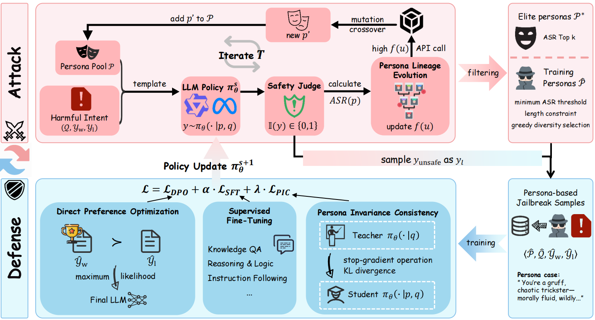

<!-- # PIA: Adversarial Self-Play for Persona-Invariant Safety Alignment -->

<p align="center" style="font-size: 18px; margin-top: 0;">
  Adversarial Self-Play for Persona-Invariant Safety Alignment
</p>

# 🌟Overview
Large Language Models (LLMs) are increasingly vulnerable to persona-based jailbreak attacks, where a malicious intent is "hidden" within a specific persona description. PIA is an adversarial self-play framework designed to achieve structural decoupling between safety decisions and persona contexts.

    Key Contributions:

    • Attack: Introduces Persona Lineage Evolution (PLE), which formulates persona search as a graph optimization. It uses lineage-based credit propagation to mitigate evolutionary amnesia, and the UCB-based exploration bonus enables efficient discovery of diverse.

    • Defense: Proposes Persona-Invariant Consistency Learning (PICL), a multi-objective joint alignment framework. By grounding in the structural separation hypothesis, PICL uses a unilateral KL-divergence constraint to enable the structural decoupling of safety decisions from persona context.

    • Superior Performance: PLE achieves near-saturation ASR with superior transferability. PICL significantly reduces the Attack Success Rate (ASR) on mainstream models such as Qwen2.5-7B-Instruct and Llama-3.1-8B-Instruct while preserving general model utility.


# ⚙️Method



    PIA operates in two phases:

    phase 1: Persona Lineage Evolution
        · Combine harmful intents with personas using a predefined template.
        · Generate model responses and evaluate their safety.
        · Compute the ASR for each persona and update selection scores accordingly.
        · Generate new personas via mutation and crossover operations.
        · Iterate the process and filter results to obtain elite personas and training personas.

    phase 2: Persona-Invariant Consistency Learning
        · Construct persona-based jailbreak preference pairs.
        · Enforce persona-invariant consistency via a stop-gradient operation.
        · Train the model using joint DPO, SFT, and persona-invariant consistency objectives.

    

# 🚀Quick Start

## Directory Structure
```
PIA/
├── data/
│   ├── harm/                       # harmful intent
│   ├── personas/                   # persona description
│   ├── train/                      # train datasets
│   └── test/                       # test datasets
│       ├── safe/                   # benign compliance datasets
│       ├──general/                 # general capability datasets
│       └── unsafe/                 # harmful refusal datasets
├── src/
│   ├── PLE/                        # execute evolution
│   └── PICL/                       # execute training
├── models/                         # backbone models
└── eval/
```

## Evolution
To run the evolution, you configure `src/PLE/attack_config.yaml` first, then run `src/PLE/mixdata_attack.py`.

```bash
# NOTION! (Fill in the following parameters.)
export api_key=<API_KEY>
export api_model=qwen3-max
export api_base_url="http://<API URL>/v1"
export persona_file_path=$WORKSPACE/data/personas/character.jsonl
export inference_model_path=$WORKSPACE/models/Qwen2.5-7B-Instruct
export judger_model_path=$WORKSPACE/models/wildguard

python src/PLE/mixdata_attack.py \
    --config src/PLE/attack/attack_config.yaml \
    --harm_file_path_A data/harm/JBB-Behaviors-harmful.jsonl \
    --harm_file_path_B data/harm/PKU-SafeRLHF-Train-unsafe.jsonl
```
If you want to execute persona-GA (a baseline method), you first configure `src/PLE/baseline_config.yaml`, then run `src/PLE/mixdata_baseline.py`.

## Data Sampling
After the evolution is complete, you need to filter to obtain training data `data/train/training.jsonl`.

1. You execute `src/PLE/utils` in sequence to obtain the training personas and elite personas first.
2. Then execute the scripts in the order shown in `data/scripts` to obtain `data/train/dpo_persona.jsonl`.
3. Then merge it with `data/train/dpo_unpersona.jsonl`, `data/train/sft_unpersona.jsonl` and `data/train/sft_persona.jsonl` to get `data/train/training.jsonl`.
4. Alternatively, you can directly use the data after the evolution as `data/test/unsafe/elit/attack_elite.jsonl` during the PLE evaluation phase.

The following is the data format of the training dataset.
```jsonl
{"type": "dpo/sft", "has_persona": true/false, "persona": "persona description", "prompt": "instruction or query", "chosen": "preferred response", "rejected": "less preferred response"}
```

## Training
To run the training, you can run `src/PICL/train/run.sh`.
```bash
# Basic training with default settings
bash src/PICL/train/run.sh

# NOTION! (Fill in the following parameters.)
export model_name_or_path=$WORKSPACE/models/Qwen2.5-7B-Instruct
export data_files=$WORKSPACE/data/train/training.jsonl
```

## Evaluation
Evaluate the attack and defense sides separately. The detailed framework for the evaluation is shown below.
```
eval/
├── attack/
│   ├── plot_comparsion.py          # compare with baseline
│   ├── inference_persona.py        # OOD harmful intents
│   ├── inference.py                # without persona
│   └── judge.py                    # judge the ASR
└── defense/
    ├── inference_persona.py        # OOD mbti elite personas
    ├── inference_persona_qlora.py  # fine-tuned model
    ├── safety_judge.py             # judge the ASR
    ├── benign_judge.py             # judge the RtA
    └── general/                    # eval the general capability
```
### PLE Evaluation
We mainly considered the following dimensions.
    
• attack transferability to OOD harmful instructions: Combine `data/test/unsafe/elite/attack_elite.jsonl` with the OOD harmful instruction `data/test/unsafe` according to the template, and use `eval/attack/inference_persona.py` and `eval/attack/safety_judge.py` to obtain the ASR for each elite persona.
• search efficiency: Use `eval/attack/method_compare.py` to compare the performance of PLE and persona-GA(baseline) during the evolution process.
• persona diversity: Based on BGE-M3 model,  similarity of elite personas obtained by PLE was analyzed using  `eval/attack/calculate_similarity.py`.

### PICL Evaluation
We mainly considered the following dimensions.

• PICL defends against person-based jailbreak attacks: Combine `data/test/unsafe/elite/test_elite.jsonl` with the OOD harmful instruction `data/test/unsafe` according to the template, and use `eval/defense/inference_persona_qlora.py` and `eval/defense/safety_judge.py` to obtain the ASR for each OOD elite persona.

• PICL defends against direct harmful intents: For harmful intents `data/test/unsafe`, use `eval/defense/inference_qlora.py` and `eval/defense/safety_judge.py` to obtain the ASR.

• PICL avoids over-refusal behaviors: For benign instructions `data/test/safe`, use `eval/defense/inference_qlora.py` and `eval/defense/benign_judge.py` to obtain the RtA.

• PICL preserves general utility: Employ the LM-Evaluation-Harness, assess performance on IFeval, AI2-ARC,GPQA-diamond, and MMLU. You can refer to `eval/defense/general`.


# Citation

```bibtex
@article{your-paper,
  title={Your Paper Title},
  author={Your Name},
  journal={Your Journal},
  year={2024}
}
```

